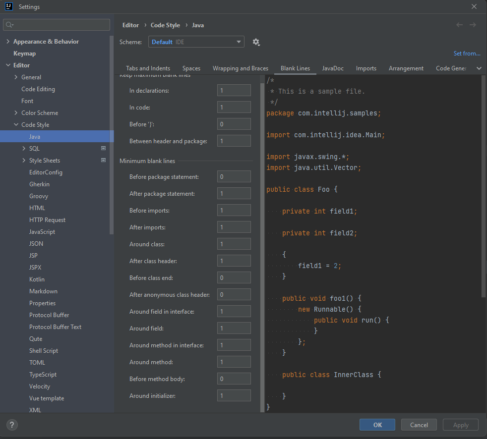

# Getting Started

----------------------------------------

## ლოკალურად გასაშვებად
1. განაახლეთ `application.properties` ცვლადები
2. root-დან გაუშვით `mvn clean install`
3. გასტარტეთ `DaskalosApplication`

----------------------------------------

## JAVA - 1.17

ჯავას დაყენების ინსტრუქცია:

1. პირველ რიგში გადმოწერეთ JDK ამ ლინკიდან https://www.oracle.com/java/technologies/javase/jdk17-archive-downloads.html
2. ამოაარქივეთ ზიპი program files-ში და bin-ის მისამართი გადაიტანეთ სისტემურ ცვლადებში path-ში.

-----------------------------------------
Maven-ის გამართვის ინსტრუქცია:

1. გადმოწერეთ Binary zip archive ამ ლინკიდან: https://maven.apache.org/download.cgi
2. ამოაარქივეთ ზიპი და bin დაამატეთ სისტემურ ცვლადებში
3. გატესტეთ ხო ნამდვილად დაემატა, ამისთვის გახსენით ტერმინალი და გაუშვით ბრძანება mvn --version, არ უნდა იყოს ერორები.

სისტემურ ცვლადებზე პრობლემის შემთხვევაში იხილეთ ვიდეო: https://www.youtube.com/watch?v=RQ_Z859Hd7Q

--------------------------
ასევე დააყენეთ node ტერმინალიდან `winget install OpenJS.NodeJS` და შეამოწმეთ:

1. node -v
2. npm -v

ასევე შესაძლოა დაგვჭირდეს microsoft fast-ის ინტეგრაცია რისთვისაც მიყვებით ამ ლინკს:
https://www.fast.design/docs/integrations/react/

--------------------------

ბაზების გამართვის ინსტრუქცია

1. PostgreSQL ჩამოწერეთ საინსტალაციო და დააინსტალირეთ https://www.postgresql.org/download/windows/
2. პრობლემების შემთხვევაში ნახეთ ვიდეო https://www.youtube.com/watch?v=MTRtusym-2s
3. ბაზებთან სამუშაო ვიზუალური ინტერფეისისთვის ჩაიწერეთ DBeaver(pgadmin-იც შეიძლება) https://dbeaver.io/download/

-------------------------

Postgre 15 ბაზებისთვის https://www.enterprisedb.com/downloads/postgres-postgresql-downloads

-------------------------

### დამატებითი ინსტრუქციები ქვემოთ:

* [Official Apache Maven documentation](https://maven.apache.org/guides/index.html)
* [Spring Boot Maven Plugin Reference Guide](https://docs.spring.io/spring-boot/docs/3.0.4/maven-plugin/reference/html/)
* [Create an OCI image](https://docs.spring.io/spring-boot/docs/3.0.4/maven-plugin/reference/html/#build-image)
* [Azure PostgreSQL support](https://aka.ms/spring/msdocs/postgresql)
* [Spring Boot DevTools](https://docs.spring.io/spring-boot/docs/3.0.4/reference/htmlsingle/#using.devtools)
* [Azure Storage](https://microsoft.github.io/spring-cloud-azure/current/reference/html/index.html#resource-handling)
* [Spring Security](https://docs.spring.io/spring-boot/docs/3.0.4/reference/htmlsingle/#web.security)
* [Spring Cloud Azure developer guide](https://aka.ms/spring/msdocs/developer-guide)
* [Spring Data JPA](https://docs.spring.io/spring-boot/docs/3.0.4/reference/htmlsingle/#data.sql.jpa-and-spring-data)
* [Azure Key Vault](https://microsoft.github.io/spring-cloud-azure/current/reference/html/index.html#secret-management)
* [Azure Active Directory](https://microsoft.github.io/spring-cloud-azure/current/reference/html/index.html#spring-security-with-azure-active-directory)

### Guides

The following guides illustrate how to use some features concretely:

* [How to use the Spring Boot starter for Azure Storage](https://aka.ms/spring/msdocs/storage)
* [Securing a Web Application](https://spring.io/guides/gs/securing-web/)
* [Spring Boot and OAuth2](https://spring.io/guides/tutorials/spring-boot-oauth2/)
* [Authenticating a User with LDAP](https://spring.io/guides/gs/authenticating-ldap/)
* [Deploying a Spring Boot app to Azure](https://spring.io/guides/gs/spring-boot-for-azure/)
* [Accessing Data with JPA](https://spring.io/guides/gs/accessing-data-jpa/)
* [Read Secrets from Azure Key Vault in a Spring Boot Application](https://aka.ms/spring/msdocs/keyvault)
* [Securing Spring Boot Applications with Azure Key Vault Certificates](https://aka.ms/spring/msdocs/keyvault/certificates)
* [Securing a Java Web App with the Spring Boot Starter for Azure Active Directory](https://aka.ms/spring/msdocs/aad)

### Additional Links

These additional references should also help you:

* [Azure Storage Sample](https://aka.ms/spring/samples/latest/storage)
* [Azure Samples](https://aka.ms/spring/samples)
* [Azure Key Vault Sample](https://aka.ms/spring/samples/latest/keyvault)
* [Azure Active Directory Sample](https://aka.ms/spring/samples/latest/aad)

-------------------------

### figma main page link: https://www.figma.com/file/hGqQRZUSssUPEbJCNydP6N/Daskalos?node-id=0%3A1&t=gh15PMOxxqHKR9pY-1

-------------------------

## auto-formatter-ის გამართვა

1. CTRL-ALT-S (Settings) -> Editor -> Code Style -> Java
2. ზუსტად ეს ციფრები უნდა ეწეროს Blank Lines სექციაში:

   
3. settings -> Tools -> Actions on Save-ში გადადით და მონიშნეთ Reformat code ჩექბოქსი, რაც შენახვისას ავტომატურად
   განაახლებს ფაილს
   სტილისტურად,

   ასევე საჭიროა auto save ჩართოთ ყოველ 1-2 წამში ერთხელ გასაშვებად, ამისთვის შედით:
   Appearance & Behavior -> System Settings და auto save სექციაში მონიშნეთ: Save files if IDE is idle for [2 secs]

### ფაილის სტილის ხელით გასასწორებლად, გაუშვით: `CTRL-ALT-L`

--------------------------